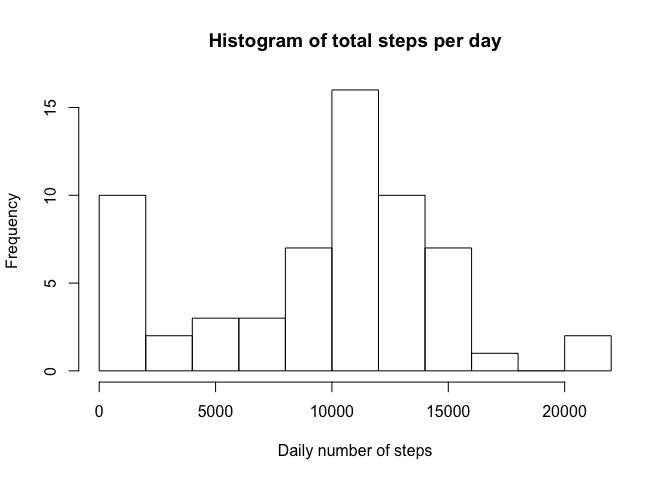
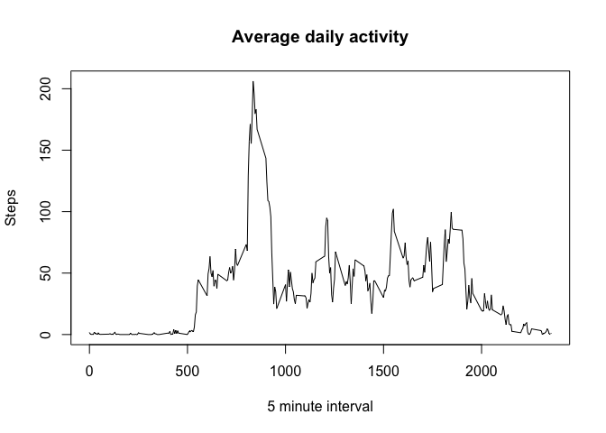
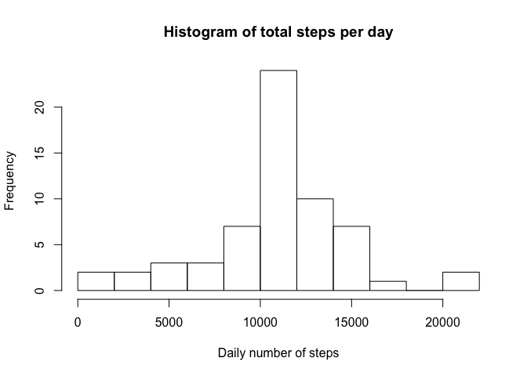
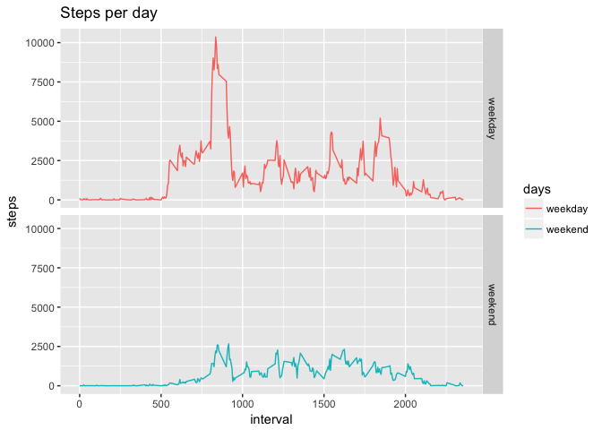

# Reproducible Research: Peer Assessment 1


## Loading and preprocessing the data

The data from the .csv file is already in the correct format to be imported with the `read.csv()` function.


```r
unzip(zipfile = "activity.zip")
activity <- read.csv("activity.csv")
```

## Loading required R packages

```r
library(dplyr, warn.conflicts = FALSE, quietly = TRUE)
library(ggplot2)
```


## What is mean total number of steps taken per day?  
  
1. First create a histogram of the total number of steps taken each day.  
  

```r
stepsPerDay <- tapply(activity$steps, activity$date, sum, na.rm = TRUE)
hist(stepsPerDay, breaks = 8, xlab = "Daily number of steps", main = "Histogram of total steps per day")
```

<!-- -->

2. Calculate and report the `mean()` and `median()` of number of steps taken per day.


```r
summary(stepsPerDay)
```

```
##    Min. 1st Qu.  Median    Mean 3rd Qu.    Max. 
##       0    6778   10395    9354   12811   21194
```

The mean of Total Steps per Day is **9354**. The median is **10395**.

## What is the average daily activity pattern?

1. First calculate the average amount of steps for each 5 minute interval, ignore missing values. 


```r
meanStepsInterval <- tapply(activity$steps, as.factor(activity$interval), mean,na.rm = TRUE)
mean(meanStepsInterval)
```

```
## [1] 37.3826
```

The average amount of steps in a 5-minute interval is **37.38**.

2. Make a time series plot `(type = "l")` of the average daily activity.

```r
plot(x = as.numeric(names(meanStepsInterval)),y = meanStepsInterval, type = "l", xlab = "5 minute interval", ylab = "Steps", main = "Average daily activity")
```

<!-- -->

3. Which 5-minute interval, on average across all the days in the dataset, contains the maximum number of steps?


```r
names(meanStepsInterval[which.max(meanStepsInterval)])
```

```
## [1] "835"
```


## Imputing missing values

1. Calculate and report the total number of missing values in the dataset (i.e. the total number of rows with `NA`)  

```r
sum(is.na(activity$steps))
```

```
## [1] 2304
```

2. Devise a strategy for filling in all of the missing values in the dataset. The strategy does not need to be sophisticated. For example, you could use the mean/median for that day, or the mean for that 5-minute interval, etc.  
**Since some days are only NA, I will use the mean for the 5-minute time interval to impute missing values**

```r
getSteps <- function(interval){
    index <- which(names(meanStepsInterval) == interval)
    meanStepsInterval[index]
}

filledActivity <- activity

for(i in 1 : nrow(activity)){
    if(is.na(activity[i,1])){
        currentInterval <- as.numeric(activity[i,3])
        filledActivity[i,1] <- getSteps(currentInterval)
    }
}
```

3. Histogram of total number of steps taken each day.


```r
filledStepsPerDay <- tapply(filledActivity$steps, filledActivity$date, sum)
hist(filledStepsPerDay, breaks = 8, xlab = "Daily number of steps", main = "Histogram of total steps per day")
```

<!-- -->

4. This is the new mean:


```r
mean(filledStepsPerDay)
```

```
## [1] 10766.19
```

5. And median:


```r
median(filledStepsPerDay)
```

```
## [1] 10766.19
```

6 . What is the impact of imputing missing data on the estimates of the total daily number of steps?  
Due to the many `NA` values in the original data, the filled dataset has a higher mean/median. This is what I expected.

## Are there differences in activity patterns between weekdays and weekends?


```r
days <- (as.factor(weekdays(as.Date(filledActivity[, 2]))))
levels(days) <- list(weekday=c("Monday", "Tuesday", "Wednesday", "Thursday", "Friday"), weekend=c("Saturday", "Sunday"))
filledActivity <- cbind(filledActivity,days)
daySum <- filledActivity %>% group_by(interval,days) %>% summarise(steps = sum(steps))

ggplot(data=daySum, aes(x=interval, y=steps, color=days)) +
    geom_line() +
    facet_grid(days ~ .) +
    ggtitle("Steps per day")
```

<!-- -->

